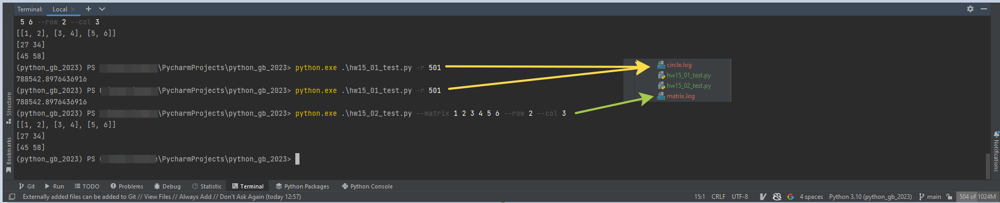

**Урок 15. Обзор стандартной библиотеки Python**

7. Возьмите любые 1-3 задания из прошлых домашних заданий. Добавьте к ним логирование ошибок и полезной информации. Также реализуйте возможность запуска из командной строки с передачей параметров. Данная промежуточная аттестация оценивается по системе "зачет" / "не зачет" "Зачет" ставится, если Слушатель успешно выполнил задание. "Незачет" ставится, если Слушатель не выполнил задание. Критерии оценивания: 1 - Слушатель написал корректный код для задачи, добавил к ним логирование ошибок и полезной информации.

>Запуск заданий для исключения некорректных импортов из:
>
>> hw15_01_test.py
>>> python.exe .\hw15_01_test.py -r 501 
> 
>> hw15_02_test.py
>>> python.exe .\hw15_02_test.py --matrix 1 2 3 4 5 6 --row 2 --col 3
> 

_**Сам код домашнего задания:**_ 

`pa15/ex07_home_1.py`

`pa15/ex07_home_2.py`

